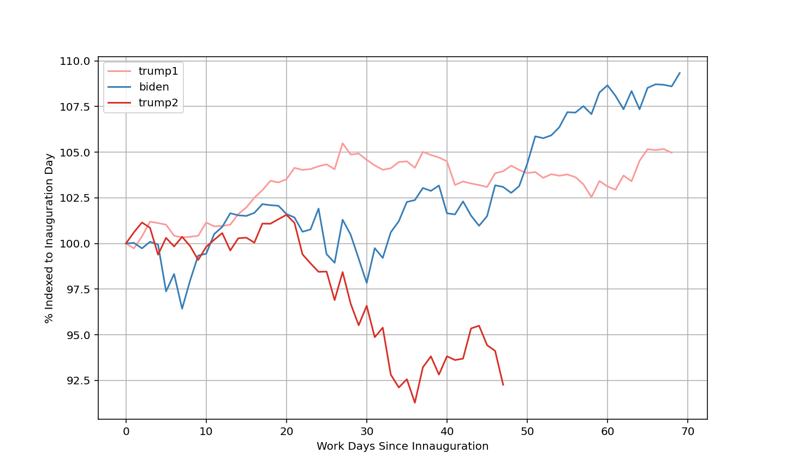

<h1 style="display: flex; align-items: center;">
  
  Economy-Explore
</h1>

A practice in obtaining data from the web and creating informative visuals to better understand how presidencies impact the economy

**KEY METHODS, MODULES, AND PROCESSES USED**
> 1. *Data extraction*
> - yfinance
> 2. *Data manipulation*
> - pandas, numpy
> 3. *Datetime object use*
> - datetime
> 4. *Data visualization*
> - matplotlib.pyplot

**DESCRIPTION:** Here, (two) reports are presented, demonstrating key economic factors that demonstrate the "health of the economy", over the course of the respective presidential terms. 

First, is the S&P500 
## S&P500 data presentation
- Looking at the closing price of the S&P500 over the course of a presidency 
can help understand how the market is affected by presidential policy
- The S&P500 is considered an index market for the general state of the 
market as a whole
- Tracking the markets closing costs over time, indexed to inauguration day
can help to understand how the market changes over time

To use the S&P500, the python modul yfinance is used
'import yfinance as yf'

### The data is presented here

---
***analysis ideas***
- Determine how presidential political affiliation impacts overall market
progress: 
### NULL HYPOTHESES
    *H0-political affiliation does not predict overall change in market price
    from beginning to end of a presidential term
    *H1-politial affilitation does not predict the overall rate of change in 
    market price over the course of a presidency

## Consumer Price Index
Gathered from the API of the US Beaureu of Labor Statistics

[Visit the BLS Developers Page for access to the API](https://www.bls.gov/developers/home.htm)

