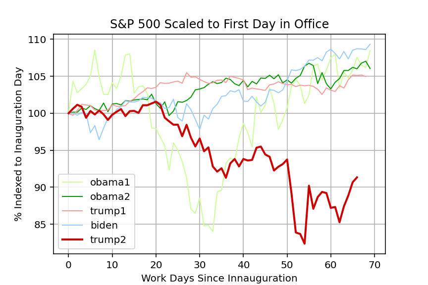

<h1 style="display: flex; align-items: center;">
  
  Economy-Explore S&P500
</h1>

**DESCRIPTION:**
This project is meant to demonstrate various data science skills with specific and relatable data visualization for the average person.

The first project is a practice in extracting stock data from a python module and plotting the data to see how the market is impacted over the course of several recent presidencies. 

**KEY METHODS, MODULES, AND PROCESSES USED**
> 1. METHOD: Data extraction via python module into dataframe, plotted using matplotlib
> 2. MODULES: yfinance, pandas, numpy, matplotlib
> 3. PROCESS: Code is executed each day to demonstrate the most recent administrations impact on the stock market relative to prior administrations

## The Economy via the S&P500
The S&P500 is the asset of choice for the following reasons
- Diverse Representation: The index includes 500 of the largest publicly traded companies across various sectors, like tech, healthcare, finance, and energy. This diversity provides insight into how different industries are performing.
- Market Capitalization: Since it's weighted by market cap, the S&P 500 reflects the influence of larger companies that significantly impact the economy. When these giants thrive or struggle, it can signal broader economic trends.
- Global Reach: Many companies in the S&P 500 operate internationally, so the index isn't just a measure of the U.S. economy—it also reflects global economic activity.
- Investor Sentiment: Movements in the S&P 500 often mirror investor confidence. For example, strong performance can suggest optimism about economic growth, while declines might point to concerns or challenges.
- Economic Indicators: The index is frequently used alongside other metrics, like GDP growth, employment rates, and inflation, to provide a fuller picture of economic health.

## How the S&P500 is used here
- Looking at the closing price of the S&P500 over the course of a presidency can help understand how the market is affected by presidential policy
- The S&P500 is considered an index market for the general state of the market as a whole
- Tracking the markets closing costs over time, indexed to inauguration day can help to understand how the market changes during the course of a presidency

## The code
To use the S&P500, the python modul yfinance is used and imported via a custom written function
<pre>
  import riskfolio as rp
import yfinance as yf
import pandas as pd
# import matplotlib.pyplot as plt
import numpy as np
from datetime import datetime

def get_asset(days_out, assets, term_names, start_terms, end_terms):
    # Specify how many days out from inauguration we want to see stock data
    # days_out = 100 # number of work days in a year
    
    # initialize dataframe dictionary
    asset_dict = {}
    
    for asset in assets:
        # initialize dataframe
        asset_df = pd.DataFrame()
        
        # collect and format asset data
        for i, start_term in enumerate(start_terms):
            data = yf.download(asset, start= start_term, end= end_terms[i])
            data = data.loc[:,'Close']
            # add list of whos term it is to the dataframe
            names = [term_names[i] for name in range(0,len(data.index))]
            data['Term_name'] = names
            
            # extract column of S&P500
            # columns_used = ['^GSPC']
            columns_used = [asset]
            data[f'{asset} Indexed'] = (data[columns_used] / data[columns_used].iloc[0]) * 100
            
            # concatenate dataframes row over row
            asset_df = pd.concat([asset_df, data], axis=0)
        
        # reset index so dates are a data column
        asset_df.reset_index(inplace=True)
        
        # aapend asset dataframe to asset dictionary
        asset_dict[asset] = asset_df
    
    return asset_dict
    
if __name__ == "__main__":
    get_asset()
</pre>
A plot function is set to create a figure using matplotlib
<pre>
  def plot_column(ax, x, y, my_title, xlabel, ylabel, line_color, legend_label, width):
    # Specify color pallate suitable for people with colorblindness
    colorblind_palette = {...
</pre>
Input parameters are set for the terms of interest and an asset is chosen
<pre>
  # set input parameters
  today = dt.today()
  today_str = today.strftime('%Y-%m-%d')
  
  ############################### Asset figure ##############################
  # specify terms of interest
  term_names =['obama1','obama2','trump1','biden','trump2']
  start_terms = ['2009-01-20','2013-01-20','2017-01-20','2021-01-20','2025-01-20']
  end_terms = ['2013-01-20','2017-01-20','2021-01-20','2025-01-20',today_str]

  # specify asset of interest
  assets = ['^GSPC']
</pre>
The function to extract the asset data is called
<pre>
  # Extract data for the S&P500
  asset_dict = extract_asset.get_asset(days_out, 
                         assets, 
                         term_names, 
                         start_terms, 
                         end_terms
                         )
</pre>
A figure object is created, the terms of interest are called and looped through to add data to the figure and plotted
<pre>
  # Create a figure and axes
  fig, ax = plt.subplots(figsize=(10, 6))
  plt.style.use('tableau-colorblind10')
  
  for i, term_name in enumerate(term_names):
      legend_label = term_name
      x_data = asset_df[asset_df['Term_name'] == term_names[i]]['Date'] - asset_df[asset_df['Term_name'] == term_names[i]]['Date'].iloc[0]
      x_trim = x_data[x_data < f'{days_out} days 00:00:00']
      x_days = x_trim.dt.days.astype(str) + ' days'
      x = [day for day in range(0,len(x_days))]
      y = asset_df[asset_df['Term_name'] == term_names[i]][f'{asset} Indexed'].values
      width = 1
      if i == len(term_names)-1:
          width = 3
      plot_column(ax, x, y[:x[-1]+1], 
                  title, x_label, y_label, 
                  color_list[i], legend_label, width
                  )
</pre>
The figure is saved to png format picture for later use
<pre>
  plt.savefig("economy_getStockAsset.png")  # Saves the figure to a .png file
  plt.show()
</pre>

### S&P500 Indexed to First Day in Office

## Short summary
- This graph illustrates the performance of the S&P 500, normalized to each president's first day in office, across the chosen presidential terms and time period.
- It highlights trends in the market during those periods relative to the start of the admnistration, providing a comparative perspective on economic patterns and presidential policy during the chosen period. 

# Key indicators of market performance and risk
The next figure shows four panels of data, summarized below.

**MARKET ASSESSMENT**
> 1. OVERALL CHANGE: The first plot shows the overall change in the market from the beginning to the end of the period assessed. A linear model was fit to the data using the '''sklearn linear regression''' module to characterize the general trajectory of the market during each period. A linear model was used for simplicity and to provide a characterization of the trend independent of short-term change in markets. A higher value indicates a larger rise in market value.
> 2. MARKET VOLATILITY: Measured here as the root mean square error. Higher values indicate greater volatility. Volatility helps investors understand potential price fluctuations and risks. High volatility may signal a need to adjust asset allocations.
> 3. MAXIMUM DRAWDOWN: Measures the largest loss (in percentage terms) that an asset experiences from its peak to its trough before a recovery to a new peak occurs. It is thought to demonstrate the worst-case scenario for an investor during a specific period. This is particularly useful for understanding the risk associated with an investment. Smaller values closer to zero are considered better.
> 4. SHARPE-RATIO: The Sharpe Ratio is a measure of risk-adjusted return. It evaluates how much return an investment generates relative to the amount of risk (volatility) it takes on. Higher positive values are considered better, while lower or negative values are riskier.

## Overall change and market volatility
Shown below is the function used to generate the linear model and capture the post to pre period change and the variation in the market
<pre>
  def fit_lm(X, y):
    # Initialize the Linear Regression model
    model = LinearRegression()
    
    # Fit the model with training data
    model.fit(X, y)
    
    # Predict the target variable using the test set
    y_pred = model.predict(X)
    
    # Evaluate the model's performance
    rmse = np.sqrt(mean_squared_error(y, y_pred))
    
    return rmse, y_pred
</pre>

## Maximum drawdown
The maximum drawdown calculates the percentage drop from the highest point to the lowest point during a given time frame
<pre>
  def calculate_mdraw_listdown(prices):
    # Calculate the running maximum
    # running_max = prices.cummax()
    running_max = np.maximum.accumulate(prices)
    
    # Calculate the drawdown
    drawdown = (prices - running_max) / running_max
    # Find the maximum drawdown
    mdraw_listdown = 100 * drawdown.min()
    return mdraw_listdown
</pre>

## Sharpe ratio
The Sharpe Ratio is a measure of risk-adjusted return. It evaluates how much return an investment (like the S&P500) generates relative to the amount of risk (volatility) it takes on.
<pre>
  def calculate_sharpe_ratio(prices, days):
    # Convert prices to returns
    price_series = pd.Series(prices)
    daily_returns = price_series.pct_change().dropna()
    # daily_returns = prices[1:] / prices[:-1] - 1
    
    annual_risk_free_rate = 0.03
    
    # convert annual risk-free rate to daily
    daily_rate = (1 + annual_risk_free_rate) ** (1/252) - 1
    
    span_risk_free_rate = (1 + daily_rate) ** days - 1
    
    # Excess returns (returns above the risk-free rate)
    excess_returns = daily_returns - span_risk_free_rate
    
    # Calculate Sharpe Ratio
    sharpe_ratio = excess_returns.mean() / excess_returns.std()
    
    # trading_days = len(prices)
    # annualized_sharpe_ratio = sharpe_ratio * np.sqrt(trading_days)
    return sharpe_ratio
</pre>

### Key Indicators of Market Performance

## Short Summary
- The first subplot the overall change in the S&P500 for the period investigated. Higher values are considered better, while negative values indicate a net negative change in market value.
- The next subplot demonstrates market volatility, where larger values indicate less stability about the general trend identified in the overall change. Less stability suggests a market where investment is riskier.
- Third is the maximum drawdown, a measure of the greatest drop in market value over the interval of interest. Lower values indicate larger drops in market value and suggest greater risk to investment.
- Last is the Sharpe-ratio, where the lower the value, the riskier the market. 

